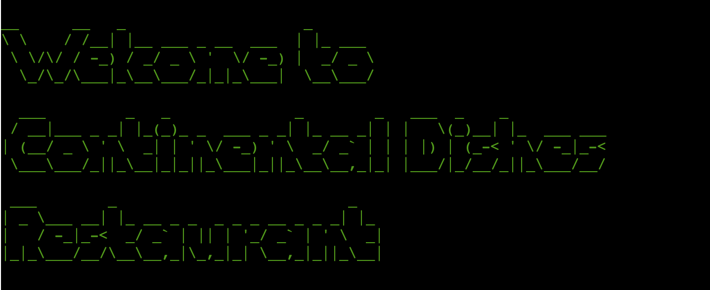
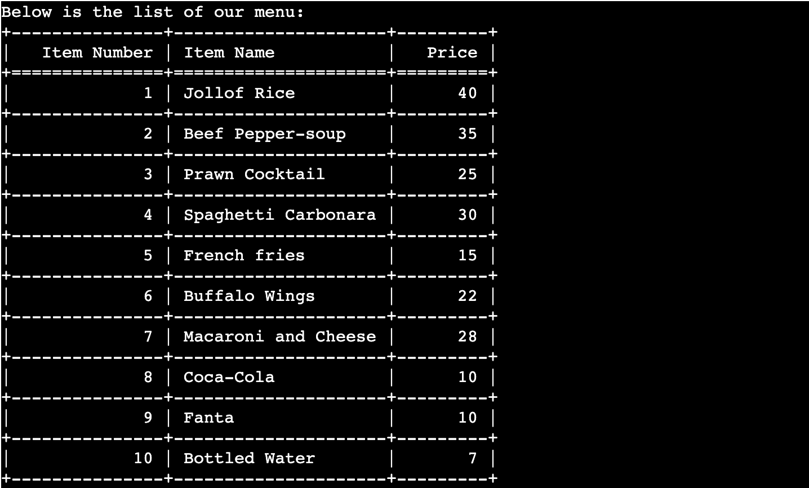
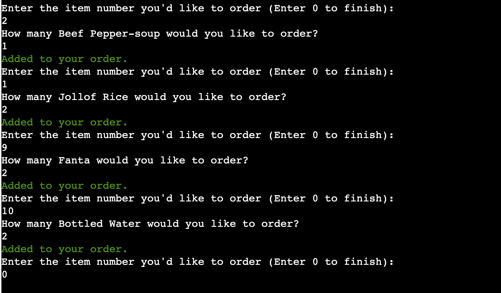
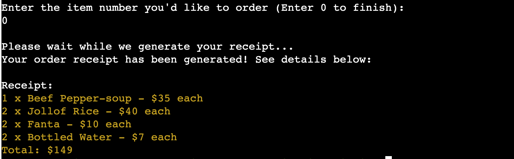
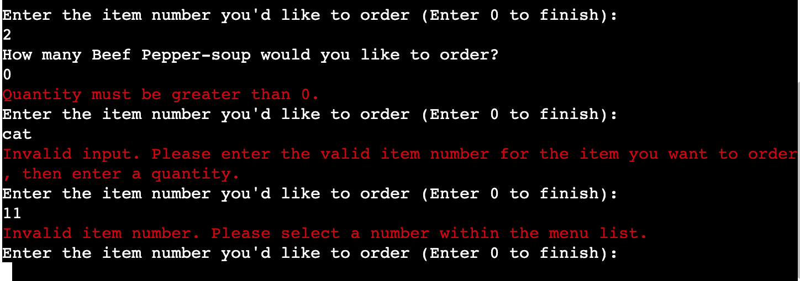
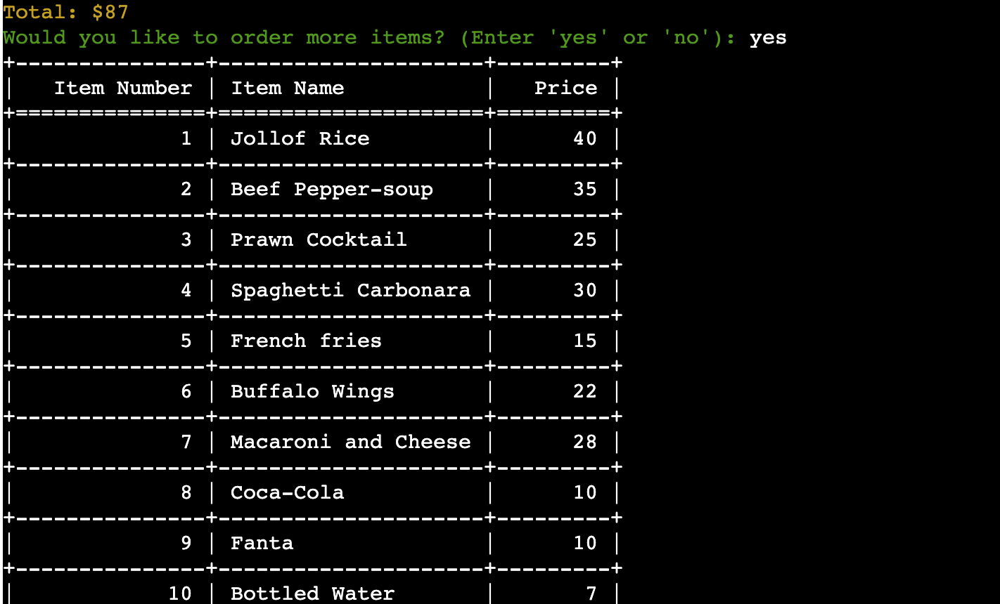
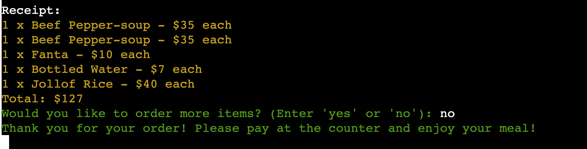
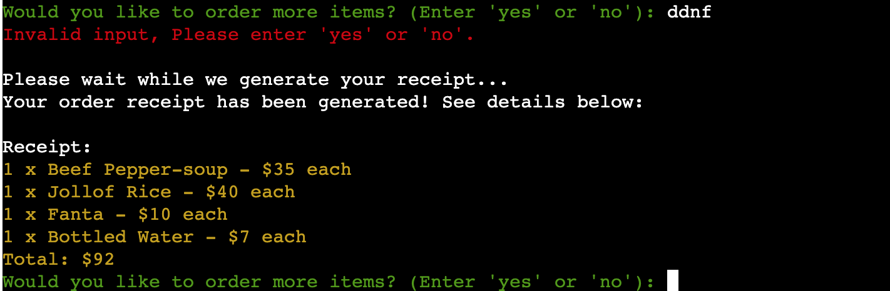
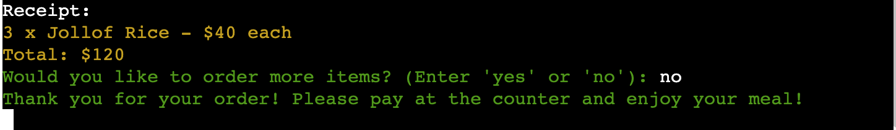
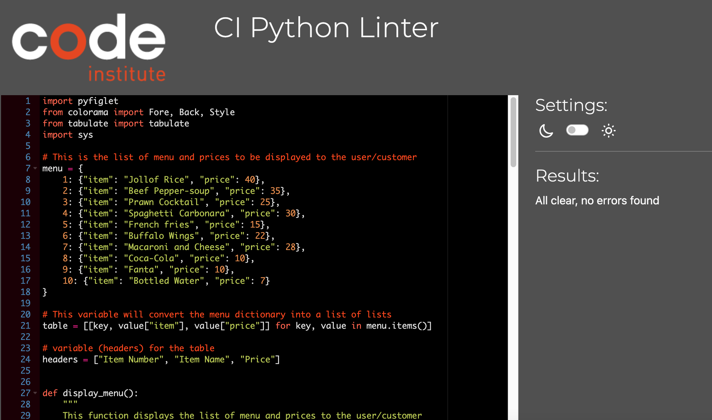

# Continental Dishes Order Placer and Receipt Generator App

[Continental Dishes Order Placer and Receipt Generator](https://continentaldishesreceipt-b3656c136b51.herokuapp.com/) App is a simple Python application that allows customers to select menu items, specify quantities, and generate a receipt for their orders. This application is designed for restaurants or food service businesses to streamline the ordering process.

## Table of Contents

- App Goal
- Features
- Features Left To Implement
- Technologies and Libraries Used
- Testing
- Installation
- Deployment
- Credits and Acknowledgement
- Contributing to the Project

## App Goal

The Continental Dishes Order Placer and Receipt Generator aims to provide a smooth and convenient ordering experience for customers while also offering error handling, customization, and a pleasant aesthetic. This application can be used as a model for restaurant ordering systems and demonstrates how technology can enhance customer service in the food industry.

## Features

### Welcome Message
The program starts with a large and fancy welcome message created using [PyFiglet](https://pypi.org/project/pyfiglet/0.7/). After displaying the welcome message, it proceeds to display the list of menu items.

### Display Menu

The menu is displayed in a tabulated format using [Tabulate](https://pypi.org/project/tabulate/), showing the item numbers, item names, and prices in an appealing tablulated order

### Main Order Placement

The user is prompted to enter the item number they want to order. If the input is within the menu range of 1 - 10, the user is then asked for the quantity. If the quantity is greater than zero, the item is added to the order. Error messages are displayed for invalid input or quantity less than or equal to zero.

### Generating Receipt

The app instructs the user to enter 0 to confirm the end of order. Once the user finishes ordering and enters '0', the program generates a receipt for the order. This receipt shows the quantity, item name, and the total cost for each ordered item. The total cost of the order is also displayed in a fancy visually appealing yellow using another Python Library called [Colorama](https://pypi.org/project/colorama/)

### Main Order Error Handling

The program uses error handling to manage user input. If the user enters an invalid item number, quantity, or any other invalid input, it displays a red error message indicating what went wrong. The user is prompted to enter valid input.

### Additional Orders

After the receipt is generated, the user is then asked if they would like to order more items with the option to type in either 'yes' or 'no'. If the user enters 'yes', the menu is displayed again, and they can place additional orders. These orders are appended to the existing order.

### Order Completion 

If the user enters 'no', the program proceeds to thank the user for their order and suggests paying at the counter and enjoy their meal.

### Additional Orders Error Handling

If the user types in any other input which is not 'yes' or 'no', the app informs them that an invalid input has been entered and displays the message again asking them if they would like to add more orders to their existing order

### Exiting The App

The program then exits using Python Library `sys.exit()` after all operations are complete. All operations are complete when the user types 'no', the final receipt has been generated and the app instructs the user to pay at the counter.

## Color Arrangements

### Green

Green text is used for positive messages and confirmation, such as items added to the order, the welcome message and the Thank you message when the order receipt has been generated.

### Yellow

Yellow text is used for displaying the items ordered and the total cost of the order.

### Red 

Red text is used for error messages, such as invalid input, an item number not in the menu, or a quantity less than or equal to zero.

## Features Left To Implement

- Invoice Number: In future updates to this app, I would like to add invoice number customization to the app so that every receipt has its own unique invoice number for even easier tracking

- CSV Documentation: In future updates, I would like to add a CSV file like Gspread to the app where a copy of each receipt generated will be stored for record purposes

- Multi-Language Support: I would also like to add support for multiple languages to cater to a more diverse customer base in future updates

- Allergies Information: In future updates, I would also include allergen information for each menu item during the order process to cater to customers with dietary restrictions

- Customer Feedback Options: Customer feedbacks is essential and in future updates, there will be option for users to provide feedbacks on the usability of the program.

- And lots more

I strongly believe that these additional features would not only improve the app's functionality but also keep it competitive in a dynamic and technology-driven restaurant industry. 

## Technologies and Libraries Used

- [Python](https://python.org): Python is the core programming language used for developing the application. Its simplicity and readability make it an excellent choice for rapid application development.

- [PyFiglet](https://pypi.org/project/pyfiglet/0.7/): The pyfiglet library is utilized to create attractive and stylized text for the welcome message. This provides a visually appealing and eye-catching introduction to the app.

- [Colorama](https://pypi.org/project/colorama/): The colorama library is used to add colored text to the terminal. It enhances the user interface by using colors to highlight important information, such as error messages in red, success messages in green and receipt information in yellow. It was also used to add GREEN color to the welcome message.

- [Tabulate](https://pypi.org/project/tabulate/): The tabulate library is used to format and display the menu items and prices in a tabular form. This makes it easy for users to view and select items from the menu.

- `Google OAuth 2.0`: The app integrates Google OAuth 2.0 for secure authorization and authentication when accessing Google Sheets. This ensures that only authorized users can modify order data.

- `sysExit`: The sys module is used for system-related functionality. In this app, it is employed to exit the program gracefully when the user has completed their order and chooses to exit.

- [GitHub](https://www.github.com/): is used to commit the codes, images, and other contents.

- [Heroku](https://www.heroku.com/): is used to deploy the program

- `Nodejs`: is used to enable the deployment of the program in Heroku.

## Testing

### Testing during development 

Throughout the development of this app, I wrote different sections of codes and were tested in a step-by-step manner using print statements, and issues such as PEP 8 line length errors, indent errors, and more were addressed along the way. Here's an overview of how the process went:

- Menu Dictionary and Taking Order Functions: Order taking functionality was developed step-by-step. I started by creating the dictionary and then the order functions. The function was written to ask the user for the item number they'd like to order and validate the user input. The app tested if the selected item existed in the menu, and if not, it displayed an error message. The order's quantity was then taken and validated, ensuring it was greater than 0. All input and error scenarios were tested extensively.

- Calculating Total for Receipt: After the order was taken, the app moved to testing the generation of receipts. It calculated the total cost of the order and displayed it along with itemized order details. Each order scenarios, including valid and invalid orders, was also tested extensively.

- Displaying Menu List with Tabulate: The next step was testing the display of the menu using the tabulate library. The data structure for the menu was converted into tabular format, and different table types were tested to ensure that it looked well-organized and visually appealing.

- Displaying Outputs with Colorama: I wanted to add a bit of life to the overall outlook of the app, I imported Colorama and tried different color options and went with Green, Yellow and Red in the end as it makes more sense. 

- Displaying Welcome Message with PyFiglet: I found that displaying the welcome message using the pyfiglet library added more visual appeal. Also, Different fonts, text styles and color were tested to find the most appealing and readable option.

- Addressing PEP8 issues: Throughout the app development, continuous attention was given to addressing PEP 8 errors, such as line length errors and indentations. Each error was fixed, and the code was reformatted to comply with PEP 8 standards to ensure clean and readable code. 

- Comments: Comments were added to each section of the development to ensure other developers can understand what was happening at each stage of the development. 

- Additional Orders: To allow users to add more items to their order after the initial order, the 'order_extra' function was written and called in the main function. It asked if the user wanted to order more items and handled the user responses. If the user chose to continue ordering, the display_menu and take_orders functions were called again, allowing users to append to their existing order.

### Final Testing and Debugging

After each individual sections of the app were written and tested, the entire program was tested as a whole. This included a final check to ensure that the different parts integrated seamlessly. The app was tested for various user scenarios, such as selecting items, adjusting quantities, and adding more items. Error handling was rigorously tested for invalid inputs and addressed at each stage. 

### Issues

I had serious issues when writing the additional order code. The `order_extra` function simply did nothing when called with the 'orders' variable. Also the `elif more_orders == 'no':` didn't work until I conducted more researches and found the `SysExit` library method.

### Validator Testing

[Pep8 Online](https://pep8ci.herokuapp.com/) was used for validating the python files and all errors reported were fixed before deployment.

## Installation

### Clone the Repository Code from Github Desktop

Navigate to the [Continental Dishes Repository](https://github.com/irishcoders/ContinentalDishes) to clone to use locally:

- Click on the code drop down button
- Click on HTTPS
- Copy the repository link to the clipboard
- Open your IDE of choice (git must be installed for the next steps)
- Type git clone copied-git-url into the IDE terminal
- The project will now been cloned on your local machine for use.

## Deployment 

### Version Control

Git was used as the version control software. Commands such as `git add .`, `git status`, `git commit` and `git push` were used to add, save, stage and push the code to the GitHub repository where the source code is stored.

### Deploy to Heroku

- The site was deployed through [Heroku](https://www.heroku.com/). 
- This project was developed utilising the [Code Institute Python Template](https://github.com/Code-Institute-Org/python-essentials-template).

- Requirements.txt file was used to import PyFiglet, Google Oauth2, Tabulate and Colorama libraries  to Heroku for deployment by running the code: `pip3 freeze > requirements.txt` in the Python terminal to update the "requirments.txt" file

Guidelines to deploy this project to Heroku is as follows:

- Go to [Heroku](www.heroku.com) and sign-in to your account
- On sign-in, click "create a new app" .
- Specify a name for your App, set the Region, and press "Create App".
- Go to "Settings" and navigate to Config Vars. Add the Config Var with a key word of `PORT` and a value of `8000`. 
- After that, Scroll down to "Buildpacks" and add buildpacks for `python` and `nodejs`
- That's all for the Settings
- Navigate to "Deploy" section,  Scroll down and set Deployment method to GitHub. Once GitHub is connected, search for your repository name, in this case, "Continentaldishes" and connect it to Heroku.
- Scroll to the bottom of the page and under "Deploy a GitHub branch", you will see "Main". Beside "Main", you will find "Deploy Branch" button.
- Click on "Deploy Branch" and allow Heroku to go through the necessary installation process.
- Once installation is complete, you will see a message saying "Your app was successfully deployed."
- Under this message, you will find "view'
- Click on View to launch the program

The App live link is [Continental Dishes App](https://continentaldishesreceipt-b3656c136b51.herokuapp.com/).

## Credits and Acknowledgements

I would like to extend my sincere gratitude and appreciation to the following individuals and resources that have contributed to the development of the Continental Dishes Order Placer and Receipt Generator App:

1. **Daisy McGirr (Mentor)**: Special thanks to my mentor, Daisy McGirr, who provided invaluable guidance and suggested the use of Python libraries to enhance the visual appeal of the app. Daisy's mentorship was also very instrumental in adding the additional order function and `SysExit` module.

2. **Pyfiglet Library**: The Pyfiglet library played a significant role in creating an eye-catching welcome message that sets the tone for the app's user experience.

3. **Colorama Library**: The Colorama library was used to add color to the terminal output, making the user interface more engaging and user-friendly.

4. **Tabulate Library**: Tabulate was used to format and display the menu in a structured and organized manner, enhancing readability for users.

5. **SysExit Module**: The SysExit module was employed to gracefully exit the program when the user chooses to complete their order, contributing to a seamless user experience.

6. **Code Institute LoveSandwishes Walkthrough Project**: The Code Institute's LoveSandwishes walkthrough project provided valuable insights and ideas for building a practical Python application, inspiring the development of the Continental Dishes Ordering App.

7. **Code Institute PEP8 Python Linter**: The PEP8 Python Linter from Code Institute was a useful tool in ensuring that the code adhered to Python's style guide, enhancing code readability and maintainability.

8. **External Resources from Python Morsels**: External resources from Python Morsels, specifically the resource on [Breaking long lines of code](https://www.pythonmorsels.com/breaking-long-lines-code-python), provided essential guidance on maintaining clean code.

9. **Creating Receipts YouTube Tutorials by Tutus Funny**: The [Creating Receipt tutorials by Tutus Funny](https://www.youtube.com/watch?v=oNIG_-rftYo) were instrumental in understanding how to create receipts within the application.

10. **Dictionary Tutorials by Corey Schafer**: The [Dictionary tutorials by Corey Schafer](https://www.youtube.com/watch?v=daefaLgNkw0) served as valuable references for working with Python dictionaries in the project.

These contributions, guidance, and resources were instrumental in the development and enhancement of the Continental Dishes Order Placer and Receipt Generator App, and I extend my heartfelt thanks to each of them.

## Contributing to the Project

Contributions to the Continental Dishes Ordering System project are welcomed. If you have ideas for new features, improvements, or bug fixes, please don't hesitate to open an issue or submit a pull request. I strongly believe that collaboration is key to creating a better user experience, and appreciate your efforts to make this app even more amazing. Thank you for considering contributing!
